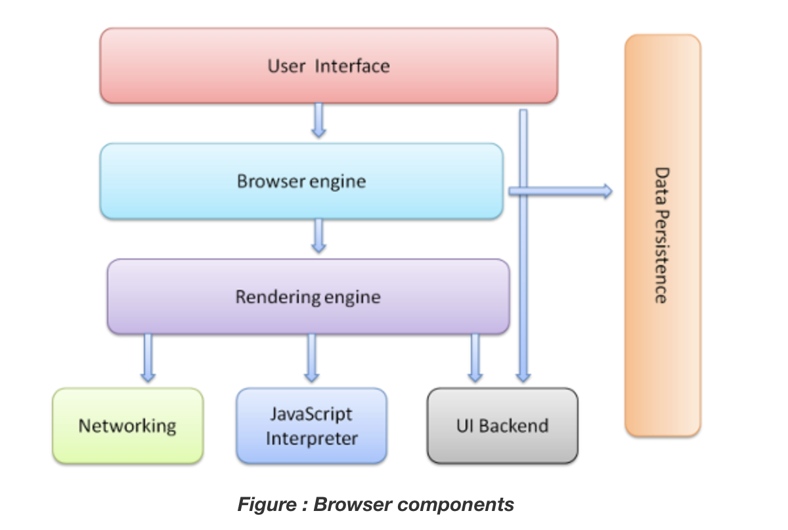

# Components

- User Interface - (Visual elements include the address bar, home button, back/next button etc...)
- Browser Engine - (Browser engine functions as an intermediary between the user interface(1) and the rendering engine(3))
- Rendering Engine - (Interprets HTML and XML documents along with images that are styled or formatted using CSS, and a final layout is generated) - IE, Safari, Chrome, FF
- Networking - (Responsible for managing network calls using standard protocols like HTTP or FTP. Take care of security issues associated with internet communication and makes alot of DNS calls to resolve domain name)
- JavaScript Interpreter - (Interpreted results are generated, they are forwarded to the rendering engine for displaying on the user interface)
- UI Backend - (Drawing basic widgets (Shapes like rectangle/square etc)
- Data Storage/Persistence - (Persistent layer: A web browser needs to store various types of data locally, for example, cookies. As a result, browsers must be compatible with data storage mechanisms such as WebSQL, IndexedDB, FileSystem, etc.)

---

## Role of Rendering Engine: 5 Steps

1. Resource gathering: Networking get all the resources that needs to display such as HTML/CSS/images etc....
2. Parse HTML & Create a DOM(Document Object Model) Tree: HTML elements are then converted into DOM nodes to DOM tree
3. Render Tree: This tree includes both the styling information and visual instructions that define the order in which the elements will be displayed. The render tree ensures that the content is displayed in the desired order. For example in css when you place display: hidden; it's actually exist in dom tree but does not render
4. Layout process: When a render tree is created, the position or size values are not assigned. The entire process of calculating values for evaluating the desired position is called a layout process. In this process, every node is assigned the exact coordinates. This ensures that every node appears at an accurate position on the screen.
5. Paint() method: Paints each node on the screen using the UI backend layer. Drawing everything to show on the interface. Espicially on the Z-Index part(What is over or under).

Whenever button/links are clicked, or just by simply dragging the web....DOM tree will constantly change and need to be re-parsed

---

---

### Links: 

[How browser works](https://www.html5rocks.com/en/tutorials/internals/howbrowserswork/)  
[Rendering engine](https://www.browserstack.com/guide/browser-rendering-engine)