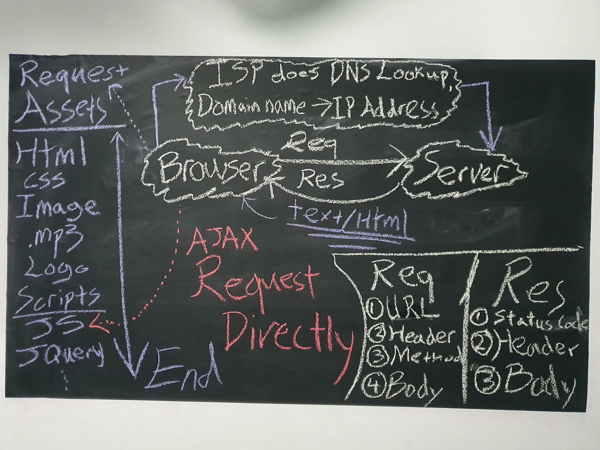
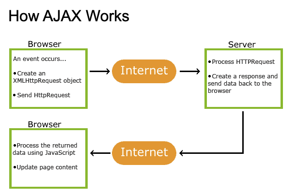
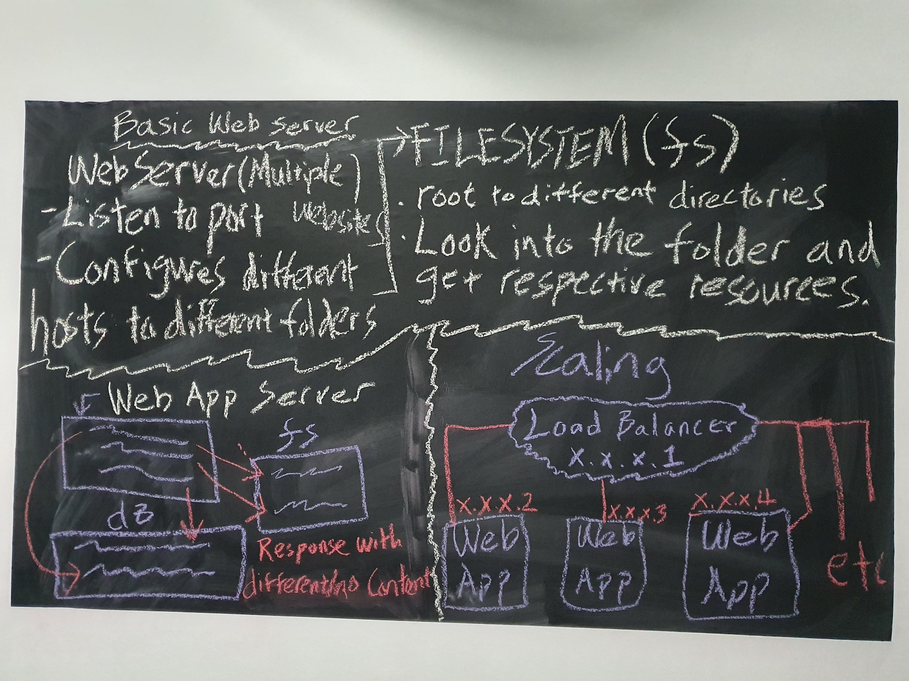

# Summary

---

## Client

---

## What is AJAX?

- AJAX = Asynchronous JavaScript And XML.

- AJAX just uses a combination of:
    - A browser built-in XMLHttpRequest object (to request data from a web server)
    - JavaScript and HTML DOM (to display or use the data)

**Advantages**
- Update a web page without reloading the page
- Request data from a server - after the page has loaded
- Receive data from a server - after the page has loaded
- Send data to a server - in the background

---

## Server

---

# Network Protocol Layers (Top to Bottom Encapsulate, then bottom to top for decapsulate)
### Simple Table(TCP as example), can be either called TCP/IP Models or UDP/IP Models

<table style="text-align: center;">
    <thead>
        <tr>
            <th>OSI</th>
            <th>TCP/IP</th>
            <th>Protocol Data Unit</th>
            <th>Devices</th>
            <th>IP Suite</th>
            <th>Function (Encapsulation Summerise)</th>
            <th>Function (Decapsulation Summerise)</th>
        </tr>
    </thead>
    <tbody>
        <tr>
            <td>7</td>
            <td rowspan=3>Application Layer Protocols</td>
            <td rowspan=3>Data</td>
            <td rowspan=3>Layer 7 Firewall</td>
            <td rowspan=3>HTTP, DNS, FTP, SSH, TLS/SSL, DHCP</td>
            <td rowspan=3>Client generates HTTP request to server</td>
            <td rowspan=3>Server receive client request and make a response to it</td>
        </tr>
        <tr>
            <td>6</td>
        </tr>
        <tr>
            <td>5</td>
        </tr>
        <tr>
            <td>4</td>
            <td>Transport Layer Protocols</td>
            <td>Segment</td>
            <td>Layer 4 Firewall</td>
            <td>TCP, UDP</td>
            <td>TCP chops the request into small packets, giving seach one sequence number and checksum</td>
            <td>TCP checks each packet that it received corrently(Checksum) and when all have arrived, combines all in the correct order</td>
        </tr>
        <tr>
            <td>3</td>
            <td>Internet Layer Protocols</td>
            <td>Packets</td>
            <td>Router / Wireless Router</td>
            <td>IPv4, IPv6</td>
            <td>Packet switching, where these packets are sent to IP address</td>
            <td>Check IP address to ensure that the pack is delivered to the correct destination</td>
        </tr>
        <tr>
            <td>2</td>
            <td rowspan=2>Network(Link) Access  Layer Protocols</td>
            <td>Frames</td>
            <td rowspan=2>Switch / Wireless Access point</td>
            <td rowspan=2>Ethernet</td>
            <td rowspan=2>Binary data makes up each packet are sent as signals. 1. electrical[Copper/Lan cable] 2. radio[Air/Vacuum 3. light[Optical fiber] to next item of network hardware </td>
            <td rowspan=2>Signals received are converted into binary data that makes up each packet</td>
        </tr>
        <tr>
            <td>1</td>
            <td>Bits</td>
        </tr>
    </tbody>
</table>

- Network communication splitted into 'layers' with different protocols on each layer
- Each layer is self-contained and only needs to know how to interface with the layer above and below it

---
### TCP(Connection-oriented transport) and UDP(Connectionless transport)

<table style="text-align: center;">
    <thead>
        <tr>
            <th>Features</th>
            <th>TCP</th>
            <th>UDP</th>
        </tr>
    </thead>
    <tbody>
        <tr>
            <td>Connection</td>
            <td></td>
            <td></td>
        </tr>
        <tr>
            <td>Segmentation</td>
            <td></td>
            <td></td>
        </tr>
        <tr>
            <td>Error checking?</td>
            <td></td>
            <td></td>
        </tr>
        <tr>
            <td>Speed/Weight</td>
            <td></td>
            <td></td>
        </tr>
        <tr>
            <td>Handshakes</td>
            <td></td>
            <td></td>
        </tr>
        <tr>
            <td>Use Cases?</td>
            <td></td>
            <td></td>
        </tr>
    </tbody>
</table>

###### TCP
- Highly reliable
- Slow
- Support Segmentation
- Use cases: Connection establishment(3 way handshake), data transfer, connection termination(4 way handsake)

###### UDP
- Less reliable (Lacks error checking and correction)
- Fast
- Does not Support Segmentation
- Use cases: DNS, DHCP, SNMP, RIP, Streaming

##### Fun facts:
- I’ve got a really good UDP joke to tell you, but I don’t know if you’ll ever get it or not...=(
- Good teachers uses TCP(get to know each other before I give you my input), but most students/bad teachers uses UDP(take my input and like it!)

---

### Links

[xml and ajax related](https://www.w3schools.com/xml/default.asp)  
[Application, Transport, Internet and Link Layers](https://www.vskills.in/certification/tutorial/application-transport-internet-and-network-access-layer/)
[Network Protocol Layers explained by example](https://www.youtube.com/watch?v=a6bH2kKZkAc)
[TCP IP Model Explained | TechTerms](https://www.youtube.com/watch?v=2QGgEk20RXM)
[Each layer of the OSI model and TCP/IP explained](https://www.youtube.com/watch?v=kCuyS7ihr_E)
[geeksforgeeks.org](https://www.geeksforgeeks.org/differences-between-tcp-and-udp/)
[UDP and TCP: Comparison of Transport Protocols](https://www.youtube.com/watch?v=Vdc8TCESIg8)
